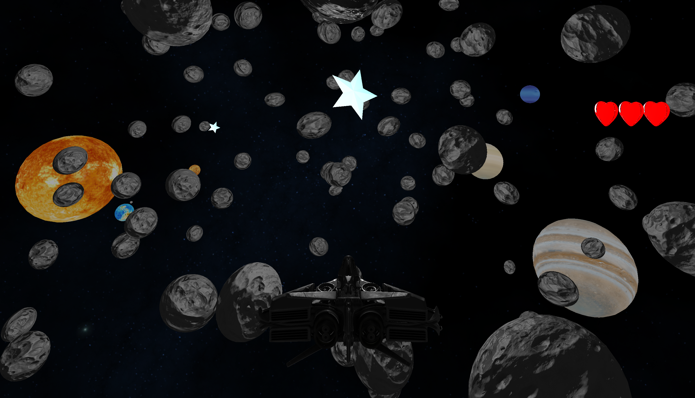

# Interactive 3D Space Flight Simulator "Interstellar Odyssey"

## Application Theme
Interstellar Odyssey is an arcade game where the objective is to collect a specific number of stars while avoiding incoming asteroids, which can also be destroyed using the player's projectiles.

### Scenes
- Space asteroids and planets  
- Asteroid belts  

### Interactions
- Ship controls
- Shooting projectiles
- Collecting stars
- Avoiding obstacles
- Destroying asteroids

### Przełożenie Metod Grafiki na Realizację Motywu Aplikacji:
* Mapowanie Normalnych: Detale powierzchni planet i asteroid, nadana trójwymiarowość.
* PBR (Physically Based Rendering): Odpowiedzialne za realistyczne oświetlenie, cienie, odbicia i tekstury wysokiej jakości na statkach kosmicznych i otaczających obiektach, stosujące model Fresnela-Schlick
* Proceduralne Generowanie Terenu: Generowanie asteroid i gwiazdek w przestrzeni kosmicznej.
* Skybox
* Kolizje
* Animacja ruchu statku: Płynne i realistyczne ruchy statku kosmicznego przy skręcaniu, wznoszeniu i opadaniu.

### Application of Graphics Methods to Realize the Theme
* Normal Mapping: Adds surface details to planets and asteroids, enhancing their three-dimensional appearance.
* PBR (Physically Based Rendering): Responsible for realistic lighting, shadows, reflections, and high-quality textures on spaceships and surrounding objects, utilizing the Fresnel-Schlick model.
* Procedural Terrain Generation: Generates asteroids and stars in outer space.
* Skybox: Provides the background environment.
* Collisions: Handles physical interactions between objects.
* Ship Movement Animation: Ensures smooth and realistic movements of the spaceship when turning, ascending, and descending.

### Team
Wiktoria Grzesik  
Maksymilian Szygenda  
Nikodem Hederych  

