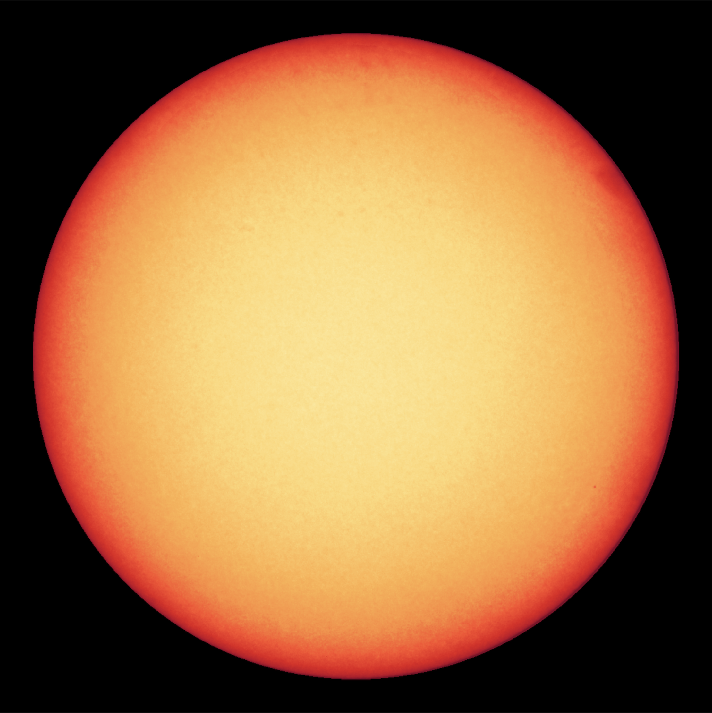

## Oświetlenie Phonga
W trakcie tych zajęć zajmiemy się implementacją modelu oświetlenia Phonga. Na poprzednich zajęciach zbudowaliśmy układ słoneczny. Wykorzystamy go w trakcie tych zajęć. Jeżeli go zrobiłeś, to przekopiuj do `ex_5_1.hpp` kod z poprzednich zajęć. W przeciwnym wypadku wykorzystaj ten, który jest zaimplementowany w `ex_5_1.hpp`. W zadaniu będzie nam potrzebny statek latający przed kamerą, jak nie ma tego w Twojej scenie to skopiuj to z `ex_5_1.hpp`.
 

## Zadanie - *diffuse*
Oblicz we fragment shaderze oświetlenie obiektu przy użyciu modelu Phonga dla odbicia rozproszonego (*diffuse)
1. Przekaż źródło światła. Na razie przyjmiemy kierunkowy model oświetlenia, dlatego źródło będzie opisane jako wektor kierunkowy: 

- Prześlij do shadera fragmentów zmienna typu `uniform vec3` (nazwij ją np. `lightDir`), w której będzie się znajdować wektor kierunkowy.
- Należy to zrobić podobnie do tego, jak przesyłany jest kolor. 
- Jako kierunek światła wybierz dowolny wektor jednostkowy. (Możesz wziąć dowolny niezerowy wektor następnie go znormalizować).

* Dodatkowo prześlij drugą zmienną `uniform vec3 lightColor`, w której umieścimy kolor światła. Prześlij tam wartości ze zmiennej `glm::vec3 lightColor`.

2. Oblicz natężenie w shaderze fragmentów:
- prześlij normalne z shadera fragmentów do shadera wierzchołków
- znormalizuj wektor normalny przed użyciem go w obliczeniach (uśrednianie wektorów normalnych wierzchołków może spowodować, że przestaje one być jednostkowe).
    
- Natężenie to iloczyn skalarny wektora normalnego powierzchni i odwrotnego wektora kierunku padania światła. Skorzystaj z funkcji `dot`.
    
- Natężenie nie może być ujemne. Przytnij natężenie do zera przy użyciu: `x = max(x, 0.0)`
3. Zastosuj obliczone natężenie, aby zmodyfikować kolor obiektu:
- Przemnóż kolor RGB fragmentu przez obliczone natężenie i przez kolor światła z `lightColor`.

## Zadanie - obsługa obrotów
Dlaczego oświetlenie statku nie zmienia się podczas jego obracania?

(Wektory normalne są w układzie lokalnym modelu, a wektor padania światła w układzie świata)

Należy wykonać transformacje wektorów normalnych do przestrzeni świata:
- Prześlij macierz modelu rysowanego obiektu (_model Matrix_) jako osobna zmienna do vertex shadera (`uniform mat4`).  
- Przemnóż przez te macierz wektor normalny wierzchołka przed przesłaniem go do shadera fragmentów.
- Współrzędna **w** dopisana do wektora przed mnożeniem przez macierz powinna być ustawiona na 0. Wynika to z tego, że w przypadku transformacji wektorów reprezentujących kierunki w przestrzeni, nie chcemy dokonywać translacji — np. wektor normalny do powierzchni zależy od orientacji obiektu, ale nie od jego pozycji (przesunięcia) w przestrzeni świata.
    

## Zadanie - *specular*
Uzupełnił model o czynnik odbicia zwierciadlanego (*specular*). W tym celu:

1. Potrzebny będzie wektor od rysowanego fragmentu do pozycji kamery:
- Wyślij pozycje kamery (`cameraPos`) jako kolejna zmienna do fragment shadera.   
- Podobnie jak wektory normalne prześlij z vertex do fragment shadera pozycje wierzchołków (`vertexPosition`) w przestrzeni świata (czyli pomnożone przez macierz **modelMatrix**). Pamiętaj, że tym razem wektory reprezentują punkty, a nie kierunki - współrzędna **w** przed mnożeniem musi być ustawiona na 1. W wyniku rasteryzacji otrzymamy w shaderze fragmentu jego pozycję (nazywaną pozycją fragmentu) 
- Oblicz wektor **V** (_view direction_) jako znormalizowaną różnice pozycji kamery i pozycji fragmentu.  

2. Oblicz natężenie światła odbitego we _fragment shaderze_:
- Oblicz wektor kierunku odbicia światła **R** przy użyciu funkcji [`reflect`](https://www.khronos.org/registry/OpenGL-Refpages/gl4/html/reflect.xhtml). Pamiętaj, żeby przesłać do funkcji odwrócony wektor kierunku światła.
- Oblicz natężenie: iloczyn skalarny **V** i **R**, przycięty do zera ( `max(...,0.0)` ), a następnie podniesiony do wysokiej potęgi (np. 8, 50, 1000), która jest miara połyskliwości powierzchni.
    
3. Ustal ostateczny kolor piksela na `objectColor * diffuse + lightColor * specular`. Oznacza to najprostszy przypadek, gdy kolor światła odbitego jest biały.

##  Zadanie - oświetlenie punktowe
W układzie planetarnym obiektem oświetlającym powinno być słońce, dlatego zamień oświetlenie kierunkowe na punktowe:

- Zamiast przesyłać (w `lightDir`) kierunek światła, prześlij pozycję słońca do fragment shadera (taką jak ustawiłeś w punkcie powyżej) jako uniform vec3 (nazwij go `lightPos`).
- Oblicz kierunek światła odejmując od pozycji fragmentu pozycję światła, znormalizuj wynik. Zapisz wynik w zmiennej `lightDir`.  
- Słońce będzie czarne, nie martw się tym, tylko spójrz na punkt następny.

## Zadanie - shader słońca
Źródło światła znajduje się wewnątrz kuli, która reprezentuje słońce, dlatego jest czarna. By to naprawić, utwórz osobny shader, który będzie odpowiadać za renderowanie słońca.

Celem tego zadania jest stworzenie shadera (**shader_4_sun.vert**_ i **shader_4_sun.frag**), który będzie odpowiadał wyłącznie za rysowanie słońca. Poprzednie shadery (**shader_4_1.vert**_ i **shader_4_1.frag**) nadal mają rysować pozostałe obiekty. a) zainicjalizuj _program_ (shadery): - Pliki **shader_4_sun.vert** i **shader_4_sun.frag** są identyczne z 4_1** przed zmianami, będą punktem wyjścia dla _shadera_ słońca.

1. Utwórz zmienną globalną `GLuint programSun` na adres shadera słońca. Stwórz _program_ za pomocą `shaderLoader.CreateProgram` analogicznie jak tworzy się `program` z **shader_4_1.vert** i **shader_4_1.frag** (parametry wejściowe to ścieżka do shadera wierzchołków i fragmentów **shader_4_sun.vert** i **shader_4_sun.frag**).

2. W skomplikowanym projekcie różne typy obiektów rysuje się przy użyciu różnych shaderów, zate potrzebna jest w programie architektura, która na to pozwala. Ustaw odpowiedni _program_ (shadery) do rysowania słońca:
- funkcja `drawObject` korzysta z globalnej zmiennej `program`, żeby wskazywać shadery do rysowania. Dodaj argument do funkcji, który będziesz przekazywać adres _programu_, który ma być wykorzystany do rysowania.
- dodaj odpowiedni _program_ w wywołaniach `drawObject`.

## Osłabienie światła, tone mapping
### Zadanie - Osłabienie światła (attenuation)
Światło pochodzące z punktowego źródła traci na sile wraz z dystansem. Wynika to z tego, że rozprasza się na większą powierzchnię. 
Dodaj ten efekt do shadera. Zamiast brać kolor światła bezpośrednio, podziel go przez kwadrat dystansu od źródła świata.

#### Tone mapping 
Przez obecną zmianę scena stała się ciemna. Wymaga to od nas zmiany 'koloru' światła na wartości dużo większe niż do tej pory. Jeśli teraz to zrobimy i przesadzimy w drugą stronę, otrzymamy efekt prześwietlenia. Wynika to z ograniczenia zakresu kolorów do $[0,1]$ (obsługą wyższych wartości nazywamy HDR). Rozwiązaniem jest pracowanie na wartościach powyżej 1 wykorzystanie *tone mappingu* do przeniesienia ich w zakres  $[0,1]$. Istnieje wiele wzorów, które są wykorzystywane do tego, jeden z nich to:

$$C_{mapped} = 1-e^{-C * E},$$
gdzie C to kolor sceny a E to parametr ekspozycji (z zakresu $(0,\infty)$, który może być dostosowany w zależności od jasności. 
### Zadanie - Tone mapping*
Zwiększ siłę słońca przynajmniej stukrotnie. Zaimplementuj powyższą metodę tone mappingu i dodaj możliwość sterowania ekspozycją za pomocą klawiszy 1 i 2. 

### Zadanie*
Dodaj drugie źródło oświetlenia w postaci reflektora statku. Reflektor świeci tylko w określonym stożku,dlatego oprócz pozycji `spotPos` posiada również kierunek `spotDir` i kąt świecenia $\phi$. Po obliczeniu dla niego `lightDir` należy sprawdzić, czy iloczyn skalarny pomiędzy `lightDir` a `spodDir` jest większy niż  $\cos\phi$ . Jeżeli nie jest, to stożek nie świeci w tym miejscu. Można ułatwić sobie implementację wielu źródeł światła poprzez przeniesienie obliczeń oświetlenia do funkcji, która przyjmuje kierunek światła i siłę naświetlenie. 

	Zwróć uwagę, że SpotDir to co innego niż light Dir w poprzednich zadaniach

## Zmień shader słońca na bardziej realistyczny.
### Zadanie*

Na poniższym obrazku jest zdjęcie słońca. Jest ono ciemniejsze na brzegach spróbuj uzyskać podobny efekt. Przydadzą się wektory z poprzednich punktów jak wektor normalny i wektor **V**.

